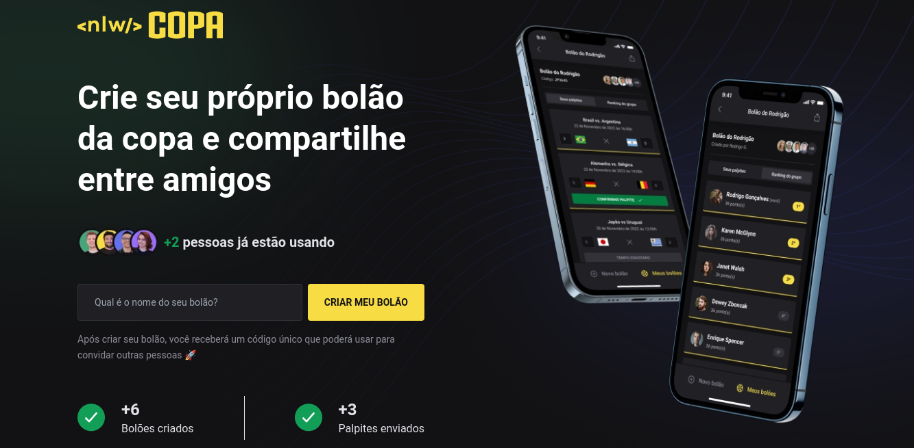

<h1 align="center">
   World Cup
</h1>

# Screens



## Technologies used

- [React](https://pt-br.reactjs.org/)
- [Vite](https://vitejs.dev/)
- [Typescript](https://www.typescriptlang.org)
- [Tailwindcss](https://tailwindcss.com/)

## Projeto:

World Cup: é um App para criar bolões e dá palpites para os jogos da copa do mundo.

## Requirements

You need to install both [Node.js](https://nodejs.org) and [Yarn](https://yarnpkg.com) or npm to run this project.

## How to use it

```bash
  # Install the dependencies
  $ yarn install
  # Run the web server
  $ yarn dev
  # Run storybook server
  $ yarn storybook
```

The app will be available for access on your browser at (http://localhost)
